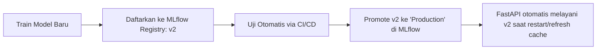

# 🛰️ Integrasi MLflow dengan AgriSensa MLOps

Dokumen ini menjelaskan cara mengintegrasikan **MLflow** ke dalam ekosistem AgriSensa untuk dua tahapan utama:
1. **Model Tracking & Registry** (Saat Pelatihan/Training).
2. **Dynamic Model Serving** (Saat API FastAPI dijalankan).

---

## 🏗️ 1. Persiapan Environment

Instal library MLflow di virtual environment Anda:
```bash
pip install mlflow
```

Tentukan **MLflow Tracking URI** (tempat menyimpan log runs dan model). Anda bisa menggunakan server lokal, cloud storage (AWS S3/GCS), atau SaaS seperti DagsHub/Databricks:
```bash
# Set environment variable untuk tracking URI
export MLFLOW_TRACKING_URI="http://localhost:5000"  # atau URL MLflow cloud Anda
```

---

## 🧪 2. Tahap Pelatihan: Logging & Register Model

Saat melakukan pelatihan ulang model, kita menggunakan MLflow untuk melacak metrik evaluasi dan mendaftarkan model yang berhasil lolos kualifikasi ke **Model Registry**.

Berikut adalah contoh skrip pelatihan (`train_yield.py`):

```python
import pandas as pd
import numpy as np
from sklearn.model_selection import train_test_split
from sklearn.ensemble import RandomForestRegressor
from sklearn.metrics import mean_squared_error, r2_score
import mlflow
import mlflow.sklearn
from mlflow.models import InferSignature

# 1. Hubungkan ke MLflow Tracking Server
mlflow.set_tracking_uri("http://localhost:5000")
mlflow.set_experiment("AgriSensa_Yield_Prediction")

# 2. Load dataset
df = pd.read_csv("yield_data.csv")
X = df[['Nitrogen', 'Phosphorus', 'Potassium', 'Temperature', 'Rainfall', 'pH']]
y = df['Yield']

X_train, X_test, y_train, y_test = train_test_split(X, y, test_size=0.2, random_state=42)

# 3. Mulai MLflow Run
with mlflow.start_run(run_name="Random_Forest_Base") as run:
    # Hyperparameters
    n_estimators = 100
    max_depth = 12
    
    # Log parameters ke MLflow
    mlflow.log_param("n_estimators", n_estimators)
    mlflow.log_param("max_depth", max_depth)
    
    # Train Model
    model = RandomForestRegressor(n_estimators=n_estimators, max_depth=max_depth, random_state=42)
    model.fit(X_train, y_train)
    
    # Predict & Evaluate
    predictions = model.predict(X_test)
    mse = mean_squared_error(y_test, predictions)
    r2 = r2_score(y_test, predictions)
    
    # Log metrics ke MLflow
    mlflow.log_metric("mse", mse)
    mlflow.log_metric("r2_score", r2)
    
    # Simpan tanda tangan input-output data (Schema validation)
    signature = mlflow.models.infer_signature(X_train, predictions)
    
    # Log Model ke MLflow Artifact Store & Daftarkan ke Model Registry
    # Model didaftarkan dengan nama 'yield_prediction_model'
    mlflow.sklearn.log_model(
        sk_model=model,
        artifact_path="yield_model",
        signature=signature,
        registered_model_name="yield_prediction_model"
    )
    
    print(f"Model berhasil dilatih dan disimpan di run ID: {run.info.run_id}")
```

---

## ⚡ 3. Tahap Serving: Memuat Model Dinamis di FastAPI

Setelah model didaftarkan ke Model Registry, kita bisa menandai model terbaik dengan tag **`Production`** atau **`Staging`**. 

Di sisi API FastAPI ([model_loader.py](file:///c:/Users/yandr/OneDrive/Desktop/agrisensa-api/agrisensa-mlops-api/ml_models/model_loader.py)), kita dapat memodifikasi pemuatan file biner lokal agar mengunduh model dinamis secara langsung dari MLflow Registry menggunakan format URL URI: `models:/<model_name>/<stage>`.

### Contoh Penyesuaian `ModelLoader`:

```python
import mlflow.pyfunc
import os
import logging
from config import settings

logger = logging.getLogger("mlops_api.model_loader")

class ModelLoader:
    _instance = None
    _model_cache = {}
    
    # Hubungkan MLflow client
    MLFLOW_URI = os.getenv("MLFLOW_TRACKING_URI", "http://localhost:5000")
    mlflow.set_tracking_uri(MLFLOW_URI)

    @classmethod
    def get_model(cls, model_name):
        """Memuat model secara dinamis dari MLflow Model Registry."""
        if model_name in cls._model_cache:
            return cls._model_cache[model_name]
            
        try:
            logger.info(f"Loading model '{model_name}' dari MLflow Model Registry...")
            
            # Format URI: models:/nama_model/stage (misal: models:/yield_prediction_model/Production)
            model_uri = f"models:/{model_name}/Production"
            
            # Load model menggunakan MLflow PyFunc (mendukung scikit-learn, LightGBM, XGBoost secara universal)
            model = mlflow.pyfunc.load_model(model_uri)
            
            # Simpan ke cache agar tidak mengunduh terus-menerus pada setiap request
            cls._model_cache[model_name] = model
            logger.info(f"Model '{model_name}' berhasil dimuat dari MLflow.")
            return model
            
        except Exception as e:
            logger.error(f"Gagal memuat model dari MLflow: {e}. Menggunakan fallback model lokal...")
            return cls._get_local_fallback(model_name)
```

---

## 🌟 4. Transisi Model / CI-CD Pipeline (Promotion)

Ketika model baru selesai dilatih dan performanya diuji di server QA/Staging, Anda dapat memperbarui versi model di MLflow tanpa mengubah satu baris kode pun di FastAPI:



Cukup ubah alias/tag versi model di dashboard UI MLflow (atau via API Python MLflow) dari `v1` ke `v2` sebagai **Production**. Pada saat container FastAPI di-restart (atau cache model di-refresh), API secara otomatis akan memuat model `v2` terbaru tanpa perlu proses build Docker ulang.
