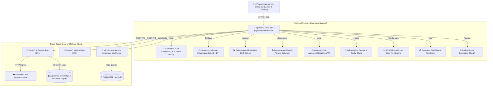

# 🌾 AgriSensa AI — Unified Smart Agriculture & MLOps Ecosystem (v2.5)

> **Platform Kecerdasan Buatan Terpadu Pertanian Presisi Tropis & Asia.**  
> Mengintegrasikan orkestrasi otomatis **n8n**, inferensi **MLOps Machine Learning**, **AI Reasoning Engine (DeepSeek-V3)**, simulasi risiko stokastik **Monte Carlo (10.000 Run)**, **Generator SOP Budidaya Ilmiah**, **Laboratorium Pupuk Majemuk & Subsidi HET**, serta **Web App Modern (Next.js 16 + Tailwind CSS)** yang responsif di seluruh perangkat.

---

## 🌐 Live Production Deployment & Domain Resmi

| Layanan / Komponen | Platform Hosting | Domain & URL Resmi | Status |
| :--- | :--- | :--- | :--- |
| **🌐 Website Resmi (Domain Utama)** | **Vercel Edge** | [**https://agrisensaofficial.com**](https://agrisensaofficial.com) | 🟢 Live (Production) |
| **🌐 Website Resmi (WWW Subdomain)** | **Vercel Edge** | [**https://www.agrisensaofficial.com**](https://www.agrisensaofficial.com) | 🟢 Live (Production) |
| **📱 Frontend Web App (Vercel App)** | **Vercel Edge** | [https://agrisensawebapp.vercel.app](https://agrisensawebapp.vercel.app) | 🟢 Live (Mirror) |
| **🤖 AI Reasoning & MCP Engine** | **Railway Cloud** | [https://ai-engine-production-cc99.up.railway.app/docs](https://ai-engine-production-cc99.up.railway.app/docs) | 🟢 Live (Online API) |
| **🧪 MLOps Inference API** | **Railway Cloud** | [https://mlops-api-production-afaf.up.railway.app/docs](https://mlops-api-production-afaf.up.railway.app/docs) | 🟢 Live (Online API) |
| **🔀 n8n Workflow Orchestrator** | **Railway Cloud** | [https://n8n-production-999a.up.railway.app](https://n8n-production-999a.up.railway.app) | 🟢 Live (14 Workflows) |
| **🗄️ Database Relasional & Vector** | **Railway Cloud** | `postgres-volume` (Internal Private VPC) | 🟢 Live (Online) |

---

## 🏗️ Arsitektur Ekosistem Terpadu



---

## ✨ Fitur & Modul Utama

### 1. 🌿 Generator SOP Budidaya Komoditas (`/sop`)
- **GAP Agronomy Standards**: Database agronomi multi-komoditas strategis (Padi Sawah, Cabai Merah, Bawang Merah, Jagung Hibrida, Tomat, Melon, Kopi Arabika/Robusta).
- **Gantt Timeline Terstruktur**: 6 fase budidaya baku (Fase 0 Olah Lahan s/d Fase 5 Panen & Pascapanen).
- **PHT Modul M-48**: Resep terukur pestisida nabati (Mimba, Tembakau, Gadung, Sirsak, Kunyit, Lengkuas, Trichoderma, Beauveria).
- **AI Microclimate Adaptation**: Penyesuaian durasi, risiko kelembaban, dan jadwal berdasarkan luas lahan (Ha), elevasi (mdpl), dan musim tanam.
- **Sitasi Jurnal Ilmiah Peer-Reviewed**: Dilengkapi rujukan ilmiah resmi bersertifikat DOI dari IPB University, BRIN/Balitbangtan, FAO, dan Elsevier.
- **Ekspor Dokumen PDF**: Fitur cetak/ekspor dokumen SOP resmi ukuran A4 lengkap dengan Nomor Registrasi SOP.

### 2. 🧪 Laboratorium Pupuk Majemuk & Formulasi Presisi (`/fertilizer`)
- **Katalog Pupuk Majemuk & Tunggal**: NPK Phonska 15-10-12, NPK Mutiara 16-16-16, NPK Mahkota 13-6-27, NPK Pelangi 20-10-10, NPK Kakao 14-12-16+4Mg, Urea, SP-36, KCl/MOP 60, ZA, dan Petroganik.
- **Skema Komparasi 3 Harga**:
  - 🟢 **Harga Subsidi (HET Permentan RI)**: Urea Rp 2.250/kg, Phonska Rp 2.300/kg, Petroganik Rp 800/kg.
  - 🔵 **Harga Non-Subsidi (Komersial)**: Harga pasar toko tani bebas kuota.
  - ⚙️ **Kustom Harga Sendiri**: Input harga dinamis per kg / per karung 50kg sesuai kios resmi wilayah setempat.
- **Nutrient-to-Weight Solver**: Menghitung 3 opsi formulasi (Majemuk Pilihan, Tunggal Terpisah, dan Hybrid 50% Organik) lengkap dengan analisis penghematan biaya (*Subsidy Savings*) dan total karung.
- **Kalkulator Organik & Resep SOP POC**: Analisis rasio C/N Balitbangtan/FAO dan ensiklopedia SOP pembuatan POC ROTAN Super, Bioaktivator Rumen Sapi, dan Biang Trichoderma Bambu.

### 3. 📚 Perpustakaan Riset & Parsing Dokumen (`/documents`)
- **Document Intelligence Engine**: Ekstraksi dan analisis mendalam untuk file PDF, Word (.docx), Excel (.xlsx), CSV, dan Text.
- **Repository Riset Bawaan**: Pustaka ilmiah internal AgriSensa (200+ halaman riset agronomi) yang langsung diparsing oleh AI Agent menjadi ringkasan eksekutif, tabel data, dan rekomendasi praktis lapangan.

### 4. 📊 Data Analyst Eksekutif & ESG Karbon (`/analyst`)
- **Autonomous Agronomy Advisor**: Analisis komprehensif hara makro/mikro, peramalan harga komoditas, dan rekomendasi strategi usaha tani.
- **Model Jejak Karbon (Scope 1-3)**: Perhitungan emisi gas rumah kaca ($N_2O$ dan $CO_2e$) dari alokasi pemupukan untuk sertifikasi pertanian berkelanjutan (ESG).

### 5. 🔬 Laboratorium MLOps & Rekomendasi Tanaman (`/mlops`)
- **Multi-Parameter Soil Input**: Pengaturan hara N, P, K, pH tanah, curah hujan, suhu, dan kelembaban udara.
- **Radar Chart Visual**: Komparasi kondisi aktual tanah vs standar ideal komoditas.
- **Explainable AI (SHAP)**: Transparansi faktor pembobot inferensi model Machine Learning.

### 6. 📈 Simulasi Risiko Stokastik Monte Carlo (`/monte-carlo`)
- **10.000 Iterasi Risiko**: Simulasi Box-Muller Normal Distribution terhadap fluktuasi cuaca, kegagalan panen, dan volatilitas harga pasar.
- **Metrik Finansial Lengkap**: Ekspektasi Laba Bersih, Peluang Profitabilitas (%), Estimasi ROI, dan Value at Risk (VaR 95%).

### 7. 📋 Generator RAB Usaha Tani Otomatis (`/rab`)
- Penyusunan Rencana Anggaran Biaya usaha tani baku terstruktur (Benih, Pupuk & Pembenah, Pestisida & Hayati, Tenaga Kerja HOK, Sewa Alat).
- Skalabilitas dinamis per luas lahan (Ha) dan ekspor cetak PDF hanya pada bagian tabel anggaran.

### 8. 🌐 Intelijen Pasar Komoditas (`/market`)
- Pantauan pergerakan harga komoditas harian Pasar Induk Indonesia (PIKJ, Pasar Caringin) dan Pasar Jepang (Niigata, Nagano).

### 9. 🤖 Asisten AI Agronomi Chat (`/chat`)
- Chatbot cerdas interaktif ditenagai **DeepSeek-V3 Engine** dengan injeksi konteks agronomi tropis dan rendering format markdown tabel yang rapi.

### 10. 📱 Pengalaman Pengguna Mobile-First
- **Sticky Bottom Navigation Bar**: Akses cepat beranda, analyst, pupuk, SOP, dan AI chat di layar smartphone.
- **Slide-in Mobile Drawer Menu**: Menu samping modern dengan efek backdrop blur yang ramah sentuhan jempol.

---

## 📁 Struktur Direktori Proyek

```
agrisensa-unified-engine/
├── 01_n8n_orchestration/          # 14 Workflow JSON untuk orkestrasi otomatis n8n
│   └── workflows/
├── 02_ai_reasoning_mcp/           # Service FastAPI AI Engine & MCP Tools
│   ├── ai_engine/
│   │   ├── sop_engine.py          # Generator SOP Budidaya GAP, Modul M-48, & Jurnal Ilmiah
│   │   ├── fertilizer_engine.py   # Solver Pupuk Majemuk, Skema Subsidi HET, & Resep POC
│   │   ├── data_analyst.py        # Executive Advisory & Strategi Agronomi
│   │   ├── document_parser.py     # PDF, DOCX, XLSX, CSV Parser & Summarizer
│   │   ├── carbon_model.py        # Scope 1-3 Carbon & N2O Footprint Model
│   │   ├── monte_carlo.py         # 10.000 Runs Stochastic Risk Engine
│   │   ├── rab_engine.py          # Generator RAB Usaha Tani Baku
│   │   └── market_intel.py        # Intelijen Pasar ID & JP
│   ├── api/
│   │   └── main.py                # FastAPI Endpoints & Singleton Manager
│   ├── Dockerfile
│   ├── Procfile
│   └── requirements.txt
├── 03_mlops_inference_api/        # Service MLOps Machine Learning & Computer Vision
│   ├── Dockerfile
│   ├── Procfile
│   └── requirements.txt
├── 04_knowledge_and_data/         # Dataset pertanian, referensi ilmiah, & embedding
└── 05_frontend_clients/
    └── agrisensa_web_app/         # Next.js 16 Web App (TypeScript, Tailwind, Recharts)
        ├── src/
        │   ├── app/
        │   │   ├── api/           # Serverless API Handlers (/api/sop, /api/fertilizer, /api/analyst, dll.)
        │   │   ├── sop/           # UI Generator SOP Komoditas
        │   │   ├── fertilizer/    # UI Laboratorium Pupuk Majemuk & Subsidi
        │   │   ├── documents/     # UI Perpustakaan Riset & Dokumen
        │   │   ├── analyst/       # UI Data Analyst Eksekutif
        │   │   ├── chat/          # UI Asisten AI Chatbot
        │   │   ├── mlops/         # UI Laboratorium MLOps & Radar Chart
        │   │   ├── monte-carlo/   # UI Simulasi Monte Carlo
        │   │   ├── rab/           # UI Generator RAB
        │   │   └── market/        # UI Intelijen Pasar
        │   └── components/        # Navbar, Sidebar, MobileBottomNav, NavigationContext
        ├── package.json
        └── next.config.ts
```

---

## 🚀 Panduan Menjalankan Secara Lokal (Local Development)

### 1. Menjalankan Backend AI Engine (FastAPI)
```bash
cd 02_ai_reasoning_mcp/api
py -m venv .venv
# Windows PowerShell:
.venv\Scripts\Activate.ps1
pip install -r ../requirements.txt
py main.py
# Server aktif di http://localhost:8001
```

### 2. Menjalankan Frontend Web App (Next.js)
```bash
cd 05_frontend_clients/agrisensa_web_app
npm install
npm run dev
# Buka di browser: http://localhost:3000
```

---

## 📜 Lisensi & Pengembang

- **Platform**: AgriSensa AI Unified Smart Agriculture Ecosystem
- **Domain Resmi**: [https://agrisensaofficial.com](https://agrisensaofficial.com)
- **Lisensi**: Proprietary / Komersial — AgriSensa Tech 2026.
