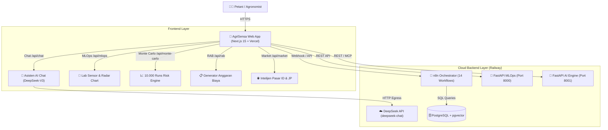

# 🌾 AgriSensa AI — Unified Smart Agriculture & MLOps Ecosystem (v2.0)

> **Platform Kecerdasan Buatan Terpadu Pertanian Presisi Tropis & Asia.**  
> Mengintegrasikan orkestrasi otomatis **n8n**, inferensi **MLOps**, **AI Reasoning Engine (DeepSeek-V3)**, simulasi risiko stokastik **Monte Carlo (10.000 Run)**, dan **Web App Modern (Next.js 15)**.

---

## 🌐 Live Production Deployment

| Komponen | Platform | URL Publik Resmi | Status |
| :--- | :--- | :--- | :--- |
| **📱 Frontend Web App** | **Vercel** | [https://agrisensawebapp.vercel.app](https://agrisensawebapp.vercel.app) | 🟢 Live (Production) |
| **🔀 n8n Orchestrator** | **Railway** | [https://n8n-production-999a.up.railway.app](https://n8n-production-999a.up.railway.app) | 🟢 Live (Online) |
| **🧪 MLOps Inference API** | **Railway** | [https://mlops-api-production-afaf.up.railway.app/docs](https://mlops-api-production-afaf.up.railway.app/docs) | 🟢 Live (Swagger UI) |
| **🤖 AI Reasoning & MCP** | **Railway** | [https://ai-engine-production-cc99.up.railway.app/docs](https://ai-engine-production-cc99.up.railway.app/docs) | 🟢 Live (Swagger UI) |
| **🗄️ Database Relasional** | **Railway** | `postgres-volume` (Internal Private Network) | 🟢 Live (Volume Attached) |

---

## 🏗️ Arsitektur Sistem Terpadu



---

## ✨ Fitur & Modul Utama

### 1. 🎛️ Command Center Dashboard (`/`)
- Telemetri status live backend Railway & Vercel secara *real-time*.
- 4 Kartu Metrik Performa (Akurasi Model 98.4%, 10.000 Monte Carlo Runs, 14 Workflows n8n, DeepSeek-V3).
- Widget Agro-Klimat & Peringatan Dini Musim Tanam.

### 2. 🤖 Asisten AI Agronomi Chat (`/chat`)
- Ditenagai **DeepSeek-V3 AI Engine** dengan *Live Market & Agronomy Context Injection*.
- Rendering teks **UTF-8 murni** menggunakan `react-markdown` dan `remark-gfm` (Tabel dosis pasti, poin nomor, huruf tebal, cetak miring latin).
- *Quick Prompts* budidaya presisi: Dosis Jagung Hibrida, Pengendalian Wereng Batang Coklat (WBC), Koreksi pH Masam dengan Kapur Dolomit, dan Patek Cabai.

### 3. 🧪 Laboratorium MLOps & Rekomendasi Tanaman (`/mlops`)
- Slider input interaktif parameter tanah (Nitrogen, Fosfat, Kalium, pH, Curah Hujan, Suhu, Kelembaban).
- **Radar Chart Visual (Recharts)** yang membandingkan kondisi hara aktual vs standar ideal.
- Penjelasan faktor kontribusi **SHAP (*Explainable AI*)** dan rekomendasi dosis pupuk baku Balitbangtan/FAO.
- Preset 1-Klik: *Padi Sawah*, *Jagung Lahan Kering*, *Cabai Merah*, *Bawang Merah*, *Kelapa Sawit*, dan *Kopi Arabika*.

### 4. 📈 Simulasi Risiko Stokastik Monte Carlo (`/monte-carlo`)
- Kalkulasi 10.000 iterasi stokastik (Box-Muller Normal Distribution) terhadap volatilitas cuaca dan harga jual.
- **Histogram Distribusi Probabilitas Keuntungan** dengan kode warna risiko.
- Analisis metrik finansial: Ekspektasi Laba, Peluang Profit (%), Estimasi ROI, dan **Value at Risk (VaR 95%)**.

### 5. 📋 Generator RAB Usaha Tani Otomatis (`/rab`)
- Penyusunan Rencana Anggaran Biaya pertanian standar dengan pemisahan kategori (Benih, Pupuk & Pembenah, Pestisida & Hayati, Tenaga Kerja HOK, Sewa Alat).
- Fitur skala luas lahan (Hektar) dinamis dan tombol **Cetak / Simpan PDF**.
- Grafik batang proporsi pengeluaran biaya per komponen.

### 6. 🌐 Intelijen Pasar Komoditas (`/market`)
- Pantauan pergerakan harga harian Pasar Induk Indonesia (PIKJ, Caringin) dan Pasar Jepang (Niigata, Nagano).
- Grafik interaktif **Area Gradient Chart 7 Hari** dan analisis fundamental volatilitas pasokan.

---

## 📁 Struktur Direktori Proyek

```
agrisensa-unified-engine/
├── 01_n8n_orchestration/          # 14 Workflow JSON untuk orkestrasi otomatis
│   └── workflows/
├── 02_ai_reasoning_mcp/           # Service AI Reasoning & Model Context Protocol (FastAPI)
│   ├── Dockerfile
│   ├── Procfile
│   └── requirements.txt
├── 03_mlops_inference_api/        # Service MLOps Machine Learning & OpenCV (FastAPI)
│   ├── Dockerfile
│   ├── Procfile
│   └── requirements.txt
├── 04_knowledge_and_data/         # Dataset pertanian, referensi ilmiah, & embedding
├── 05_frontend_clients/
│   └── agrisensa_web_app/         # Modern Web App (Next.js 15, TypeScript, Tailwind, Recharts)
│       ├── src/app/
│       │   ├── api/               # Server-side Route Handlers (/api/chat, /api/mlops, /api/monte-carlo)
│       │   ├── chat/              # AI Agronomist Chatbot
│       │   ├── mlops/             # MLOps Lab & Radar Chart
│       │   ├── monte-carlo/       # Monte Carlo 10k Simulator
│       │   ├── rab/               # Budget Generator
│       │   └── market/            # Commodity Market Intel
│       └── .env.local
├── vercel.json                    # Konfigurasi deployment otomatis Vercel
├── .env                           # Konfigurasi master environment lokal
└── README.md                      # Dokumentasi komprehensif sistem
```

---

## 💻 Panduan Menjalankan Secara Lokal

### 1. Menjalankan Frontend Web App (Next.js):
```powershell
cd 05_frontend_clients\agrisensa_web_app
npm install
npm run dev
```
Buka browser di: **`http://localhost:3000`**

### 2. Menjalankan Service MLOps API (Port 8000):
```powershell
cd 03_mlops_inference_api
pip install -r requirements.txt
uvicorn main:app --reload --port 8000
```

### 3. Menjalankan Service AI Reasoning Engine (Port 8001):
```powershell
cd 02_ai_reasoning_mcp
pip install -r requirements.txt
uvicorn api.main:app --reload --port 8001
```

---

## 🗺️ Rencana Pengembangan Berikutnya (Roadmap):

- [x] Bootstrapping Next.js 15 & Arsitektur App Router Modern.
- [x] Integrasi DeepSeek-V3 AI dengan prompt pakar agronomi tropis.
- [x] Visualisasi Recharts (Radar Chart, Area Trend, Histogram Bar Chart).
- [x] Penyempurnaan tipografi dan rendering UTF-8 murni (`react-markdown` + `remark-gfm`).
- [ ] Penambahan modul upload & diagnosa foto penyakit daun via kamera HP (Computer Vision).
- [ ] Dashboard integrasi sensor telemetri IoT (MQTT/HTTP) langsung dari lapangan.
- [ ] Fitur multi-bahasa (Bahasa Indonesia, Jawa, Sunda, dan Inggris).

---

**© 2026 AgriSensa AI Ecosystem.** *Empowering Farmers with Precision Intelligence.*
